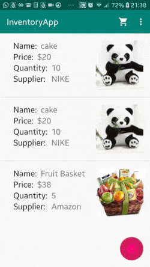
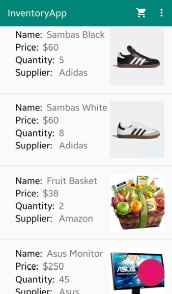
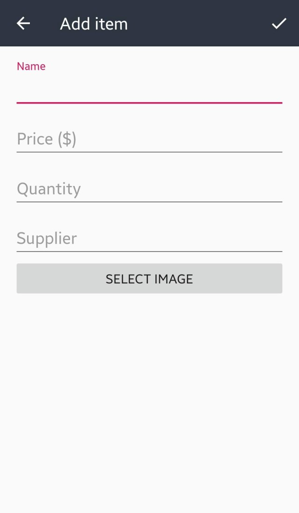
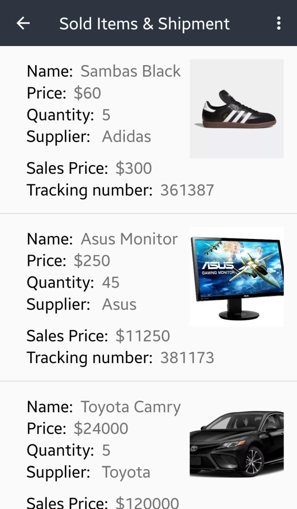

# Inventory App

### Type:Android

### Language: Java

### Project Overview:

Create a store that allows to add items, and let customers buy the items. 

Store the items in a SQLite database

### Libraries Used

- Glide : To handle images
- LeakCanary - To test app for memory leaks

